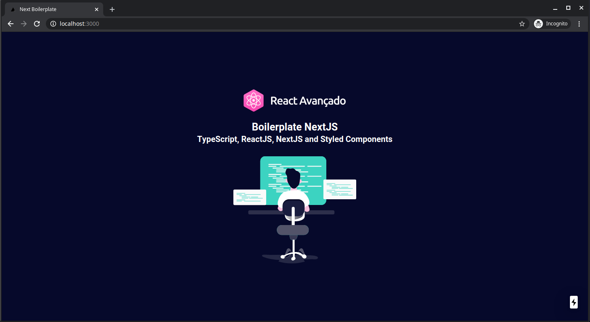
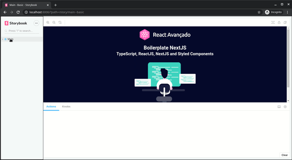

# 🚀 Boilerplate NextJs


Boilerplate é um stater criado no curso **React Avançado** no qual foi preparado toda uma estrutura base para iniciar novos projetos.



# Motivação

Sempre que vai iniciar uma projeto em NextJS apesar de já vir várias coisas já pré configurada, ainda precisamos configurar ferramentas adicionais
para ajudar no desenvolvimento tal como ferramentas de testes, linters, documentação, estrutura de pastas e etc. Com isso em vista
o autor do curso teve a saca de criar um boilerplate no qual será útil para os projetos criados o curso e para futuros projetos que virá surgir.

# Tecnologias

Algumas tecnologias que são usadas nesse projeto.

- [NextJS]().
- [Jest]().
- [Typescript]().
- [Styled Components]().
- [Storybook]().
- [Eslint]().
- [Prettier]().

# Como usar esse projeto

Usando npm:

```
TODO
```

Usando yarn:

```
yarn create next-app -e https://github.com/apteles/boilerplate-nextjs
```

# Documentação

Nesse projeto foi utilizado **storybook**. Para um preview execute o comando `yarn storybook`. Veja um preview:



Documentação de como utilizar a ferramenta veja [AQUI](https://storybook.js.org/docs/basics/introduction/).

# Testes

Pré configurado, temos o `jest` em conjunto com `React Test Library`.

Executando os testes:

```
❯ yarn test
yarn run v1.21.1
$ jest
 PASS  src/components/Main/test.tsx
  <Main/>
    ✓ should render the heading (134 ms)
    ✓ should render the colors correctly (24 ms)
...
```

Documentação de como utilizar a ferramenta [RTL](https://testing-library.com/docs/intro) e [Jest](https://jestjs.io/docs/en/getting-started).

## Licença


